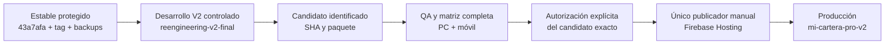

**FASE 2 completada en modo de lectura.** No ejecuté bloqueos, eliminaciones, cambios estructurales ni publicaciones.

Los resultados principales son:

- GitHub Pages sigue publicando un build anterior al estable.
- El workflow Firebase está registrado como activo, pero actualmente carece del secreto que exige para desplegar.
- Firebase CLI constituye otro acceso al mismo destino y debe quedar sometido al control de publicación.
- La clasificación propuesta cubre las **79 ramas: A=2, B=27, C=32, D=6, E=12**.
- `credit-share.js` queda **E**, por su dependencia dinámica V1.
- El commit/tag/build estable permanecen intactos.

Las clasificaciones y acciones siguientes son propuestas para revisión externa. **No están ejecutadas.**

**A. Mecanismos de publicación**

**1. Deploy V2 Firebase Hosting**

| Campo | Identificación |
|---|---|
| Nombre | `Deploy V2 Firebase Hosting` |
| Workflow | `deploy-v2-firebase.yml` |
| Ruta absoluta | `C:/Users/Advance/Documents/Codex/2026-10-07/trabaja-directamente-sobre-mi-cartera-pro/work/repo/.github/workflows/deploy-v2-firebase.yml` |
| ID GitHub | `362828975` |
| Trigger automático | `push` |
| Rama | `reengineering-v2-final` |
| Filtro de archivos | `v2/app/**`, `firebase.v2.json`, `.firebaserc` y el propio workflow |
| Trigger manual declarado | `workflow_dispatch` |
| Tags/otros eventos | No declara publicación por tag, PR, schedule, release ni `workflow_run` |
| Proyecto | `mi-cartera-d0d8c` |
| Target | `hosting:v2` |
| Site | `mi-cartera-pro-v2` |
| Directorio público | `v2` |
| Configuración | `firebase.v2.json` |
| Clasificación | **ACTIVO en código y registrado en Actions; actualmente bloqueado por credencial ausente** |

El comando utiliza explícitamente:

`firebase deploy --only hosting:v2 --project mi-cartera-d0d8c --config firebase.v2.json`

La consulta de metadatos GitHub confirmó:

- Propietario del repositorio: cuenta personal.
- Secreto de repositorio `FIREBASE_TOKEN`: **no existe**.
- El job no declara un environment del que pudiera obtener ese secreto.
- El workflow exige que ese valor exista antes de ejecutar el deploy.
- Sus últimas ejecuciones consultadas terminaron en `failure`, incluida la correspondiente a `1ed4f5d`.

No atribuyo esas ejecuciones fallidas a una causa de log que no inspeccioné. La ausencia actual del secreto sí impide superar la condición declarada de despliegue.

**Debe sobrevivir como único publicador futuro**, después de convertirlo en ejecución manual controlada por SHA aprobado, QA completo y autorización. **No debe conservar el deploy automático por push.**

**2. V2 Audit Pages**

| Campo | Identificación |
|---|---|
| Nombre | `V2 Audit Pages` |
| Workflow | `v2-audit-pages.yml` |
| Ruta absoluta | `C:/Users/Advance/Documents/Codex/2026-10-07/trabaja-directamente-sobre-mi-cartera-pro/work/repo/.github/workflows/v2-audit-pages.yml` |
| ID GitHub | `360791786` |
| Trigger automático | `push` |
| Rama | `reengineering-v2-final` |
| Filtro de archivos | `v2/**` y el propio workflow |
| Trigger manual | `workflow_dispatch` |
| Tags/otros eventos | No declara publicación por tag, PR, schedule ni release |
| Destino | GitHub Pages; no publica Firebase |
| URL | [GitHub Pages de Mi Cartera](https://arturohoyosdargent.github.io/mi-cartera/) |
| Entrada generada | `/v2/app/index.html` |
| Environment | `v2-audit` |
| Clasificación | **DUPLICADO como canal de publicación; operativo actualmente** |

Construye y publica copias de `v2/app`, `v2/core` y `v2/cloud`. Declara permisos `pages: write` e `id-token: write`.

La consulta confirmó:

- Workflow registrado `active`.
- Publicación exitosa de `1ed4f5d`.
- Environment `v2-audit` sin reglas de aprobación.
- El `release.json` público de Pages responde con:

`v2-pilot-20261007-b2-selective-recovery-2`

Por tanto, **Pages sirve una versión distinta del estable oficial `43a7afa`**. Esto es una fuente concreta de confusión entre instalaciones y URLs.

Recomendación: conservar, si se necesita, la parte de verificación/artifact; **retirar su capacidad de publicación** y decidir expresamente la retirada del sitio secundario.

**3. Firebase CLI manual**

| Campo | Identificación |
|---|---|
| Herramienta | Firebase CLI |
| Entradas instaladas | `C:/Users/Advance/AppData/Roaming/npm/firebase.ps1`, `firebase.cmd` y `firebase` |
| Trigger | Ejecución humana o de un script |
| Restricción por rama/tag | Ninguna automática; depende del checkout, configuración y directorio seleccionados |
| Destino V2 conocido | Proyecto `mi-cartera-d0d8c`, target `hosting:v2`, site `mi-cartera-pro-v2` |
| Capacidad | Puede alcanzar el mismo Hosting independientemente de GitHub Actions |
| Credenciales actuales | No revalidadas contra Firebase en esta fase |
| Clasificación | **Canal paralelo que debe quedar fuera del procedimiento ordinario autorizado** |

Desactivar un workflow **no impide** una publicación mediante CLI con credenciales suficientes.

Recomendación: el procedimiento futuro de Codex debe autorizar exclusivamente el workflow controlado. Los scripts/paquetes históricos de CLI deben permanecer bloqueados para publicación. Un control técnico completo de credenciales requiere una revisión administrativa posterior expresamente autorizada; no se realizó aquí.

**4. Pages dinámico histórico**

| Campo | Identificación |
|---|---|
| Nombre | `pages-build-deployment` |
| Referencia GitHub | `dynamic/pages/pages-build-deployment` |
| ID | `353826731` |
| YAML local | No existe en las referencias examinadas |
| Evento histórico observado | `dynamic` |
| Rama histórica | `main` |
| Destino | GitHub Pages |
| Última ejecución consultada | `main@10f384c`, septiembre de 2026 |
| Estado actual de Pages | `build_type: workflow` |
| Clasificación | **E para su capacidad actual; mecanismo histórico adicional de Pages** |

No debe confundirse con `V2 Audit Pages`. Que el registro figure `active` no acredita por sí solo que el mecanismo dinámico pueda activarse con la configuración actual.

**Limitación que debe resolverse al preparar el publicador manual:** `main` sigue siendo la rama predeterminada y no contiene el workflow Firebase actual. GitHub documenta la presencia del workflow en la rama predeterminada como requisito de `workflow_dispatch`. La configuración del futuro canal manual debe resolver esto expresamente, sin mover `main` ni utilizar su árbol como fuente V2. [Documentación de GitHub](https://docs.github.com/es/actions/how-tos/manage-workflow-runs/manually-run-a-workflow).

**B. Clasificación de las 79 ramas remotas**

| Categoría | Cantidad | Tratamiento propuesto |
|---|---:|---|
| A | 2 | Conservar su función actual; una sola línea será fuente V2 |
| B | 27 | Conservar historia útil; posteriormente puede trasladarse a referencias de archivo verificadas |
| C | 32 | Bloquear como bases de nuevas implementaciones; archivar antes de considerar eliminación |
| D | 6 | Candidatas técnicas a eliminar, con autorización individual |
| E | 12 | Mantener hasta resolver PR, propósito o recuperación |

**Criterios utilizados**

- Se compararon las 79 ramas contra el estable remoto y contra `main`.
- Se consultó el estado de los PR disponibles.
- **“PR fusionado” y “SHA conservado en el tag estable” son comprobaciones distintas.**
- Un número de commits fuera del tag **no significa ese número de funciones perdidas**. Puede haber cambios equivalentes recuperados posteriormente con otros SHAs.
- No declaré una rama abandonada únicamente por su fecha.

Para compactar las tablas:

- **R0:** recuperación desde `stable-rollback-v2-20261008-43a7afa`, buscando el SHA indicado. Su historia conserva el commit.
- **R1:** SHA alcanzable desde `main@6df954437e39163c3a2989a9ed095b026c3e4e70`. **No es otra referencia oficial de rollback protegida**; debe archivarse antes de borrar la rama.
- **R2:** mantener la propia rama en el SHA indicado hasta crear y verificar una referencia/bundle de archivo. No se acreditó cobertura de ese SHA por R0.
- **M/A:** riesgo medio/alto de eliminación en el estado actual.

Todas las ramas están en `arturohoyosdargent/mi-cartera`, bajo `refs/heads/<nombre>`.

**A — dos ramas necesarias**

| Rama | SHA remoto | Función |
|---|---|---|
| `reengineering-v2-final` | `1ed4f5d7632008a6523b35713e4edfd168e8ac96` | Línea V2 existente; todavía un commit detrás del estable. No se movió |
| `main` | `6df954437e39163c3a2989a9ed095b026c3e4e70` | Rama predeterminada y referencia administrativa/histórica. **No es fuente autorizada de producción V2** |

La clasificación A de `main` conserva su papel administrativo. No autoriza importar su implementación completa ni convertirla en la base del candidato.

**C — 32 ramas para bloquear/archivar**

“Fuera R0” indica commits de historia no alcanzables desde el tag estable. Todas estas ramas tienen historia fuera de R0.

| Rama | Último SHA | Propósito histórico | Merge observado | Fuera R0 | Recuperación / riesgo |
|---|---|---|---|---:|---|
| `ci-main-v2-greenfield-20260930` | `937f116a06d78f6a2bf5eec2c2de66bc1ba8aed9` | CI Greenfield hacia main | PR40 fusionado | 252 | R1 / M |
| `cierre-integral-20261001` | `54fdcac58124adeb0b7df15b6b2da4f1f411f4b5` | Integración antigua Socios/Caja/PWA | PR42 fusionado | 255 | R1 / M |
| `cierre-movil-pendientes-20261002` | `edc46680d481343d6f0de8f26e26e42d74c781cb` | Integración móvil anterior | PR45 fusionado | 262 | R1 / M |
| `development-after-recovery` | `b56eae5e5e7644a1332cb14b2896b7a4c14cd81a` | Línea posterior a final4 | Sin PR localizado; incluida en main | 21 | R1; mismo SHA que backup final4 / M |
| `feature-interest-renewal-2026-09-16` | `ba9cd27a0f2255313467b36393e382c804258089` | Renovación/solo interés legacy | PR17 fusionado; SHA fuera de main | 2 | R2 / A |
| `financial-reconciliation-core-2026-09-15` | `0c45a53aede47219903ac1b362221ea80566a890` | Conciliación V1 | PR14 fusionado; SHA fuera de main | 3 | R2 / A |
| `fix-interest-autocalc-2026-09-16` | `cf7f082d7a1470c788ce8e26ffd9422713bf745c` | Carga/autocálculo renovación legacy | PR18 fusionado; SHA fuera de main | 2 | R2 / A |
| `fix-ledger-reconciliation-executable-2026-09-16` | `56e1339e97a83f4bb038ed97b346a3ae8ddcc68f` | Conciliación ejecutable legacy | PR16 fusionado; SHA fuera de main | 2 | R2 / A |
| `fix-payment-authority-quota-renewal-2026-09-16` | `f54a4b12274d8ee6c0dc8df45fd3c6a71af58cea` | Reparación pagos/renovación/backoff legacy | PR19 fusionado; SHA fuera de main | 4 | R2 / A |
| `fix-qa-cache-contract-2026-09-15` | `aa8eb4741d58130e27089a9ba5882da167c9d13d` | Contrato QA/compartir V1 | PR8 fusionado; SHA fuera de main | 1 | R2 / A |
| `fix-renewal-image-priority1` | `3973079a4e0c14c913d125c39df1733c47654ccc` | Imagen de renovación anterior | PR27 fusionado; SHA fuera de main | 1 | R2 / A |
| `hotfix-credit-search-paid-guard-2026-09-15` | `ced6f93b5e6685ad301092af6108eb5f8b10bfa5` | Búsqueda y guardia V1 | PR12 fusionado; SHA fuera de main | 2 | R2 / A |
| `hotfix-current-user-2026-09-15` | `eb8ae96e6c9237985ae768c70164602a645dd909` | Guardia de sesión V1 | PR4 fusionado; SHA fuera de main | 2 | R2 / A |
| `hotfix-mobile-clean-2026-09-15` | `728d0e810204062ae7d10ddf74962ff1f5a3ff80` | Hotfix móvil y cierre QA legacy | PR3 fusionado; SHA fuera de main | 6 | R2 / A |
| `hotfix-mobile-error-2026-09-15` | `e8aa9fdfb74f55f233ceee70407f3739f2ef8dd8` | Error móvil/cierre documental | Sin PR localizado | 5 | R2 / A |
| `hotfix-new-credit-client-2026-09-15` | `b887b2292e326e0d5e6d5e9917b15d3844a94110` | Apertura de crédito V1 | PR10 fusionado; SHA fuera de main | 2 | R2 / A |
| `hotfix-payment-evidence-2026-09-15` | `100a0ce1e0261ba39ebe6f268882a8741deb6133` | Evidencia de pago legacy | PR13 fusionado; SHA fuera de main | 1 | R2 / A |
| `hotfix-payment-safety-2026-09-15` | `126578f6c6503d180191dddcf33519d3cf120968` | Protección de recaudos V1 | PR11 fusionado; SHA fuera de main | 2 | R2 / A |
| `hotfix-quick-new-2026-09-15` | `44064f105997a611e4fbccfff2a2c87cda5b7e28` | Botón Nuevo V1 | PR9 fusionado; SHA fuera de main | 2 | R2 / A |
| `parallel-qa-fix-20260918` | `32244dd131d13ffd340262718c88d2485841ac46` | QA de consistencia de otro candidato | PR25 cerrado sin merge | 7 | R2 / A |
| `post-final4-business` | `48743027ea2a0e59aa96eacd431b51c415b83a55` | Integración comercial/stable6 anterior | PR34 fusionado | 238 | R1 / M |
| `qa/post-merge-partner-interest-20261006` | `f986eafd41cc54df7e0337e432a342c39ec74cdf` | Disparo QA de Socios | PR57 cerrado sin merge | 290 | R2 / A |
| `qa-full-regression-20260924` | `503cab34ba3cb3a8017810e7766b1f64561fdb3d` | Regresión antigua | PR33 fusionado a post-final4; SHA fuera de main | 186 | R2 / A |
| `qa-regression-financial-2026-09-15` | `f9593c2ead18bacb37a216cfce221d44944260c9` | QA financiero legacy | PR15 fusionado; SHA fuera de main | 1 | R2 / A |
| `reengineering-v2-core` | `3fb88f01e429c23e14c6018c3f5bad95817a109b` | Núcleo inicial V2 | PR20 fusionado a reengineering-v2 | 1 | R2 / A |
| `reengineering-v2-migration` | `a42c2c4696bb4f3f56ae9aeb21a1cff0009a68ba` | Auditoría/migración inicial | PR21 fusionado a reengineering-v2 | 1 | R2 / A |
| `reengineering-v2-tests` | `611d256d24f5acc029ee3aa4d594dd0d39af8715` | Pruebas iniciales V2 | Sin PR localizado | 1 | R2 / A |
| `reengineering-v2` | `003d918ddeeecc90b4309ccf993cf3d64db0309e` | Base inicial y CI V2 | Sin PR localizado | 1 | R2 / A |
| `stabilization-core-clean-2026-09-15` | `4a739fe60ad1181692140184baff0eca1bd33031` | Contrato runtime legacy | PR6 fusionado; SHA fuera de main | 2 | R2 / A |
| `stabilization-financial-core-2026-09-15` | `f5c09d134adaa1b8ce02878add81a6ef828ca467` | Smoke financiero legacy | PR7 fusionado; SHA fuera de main | 1 | R2 / A |
| `stable-recovered-20260920` | `25a4ca0e3380a525b8f4e2c360b15b1293512931` | Alias de recuperación antigua | Incluida en main; sin PR localizado | 2 | R1; mismo SHA que recovery-clean-scope / M |
| `stable-verified-final4-20260920` | `b56eae5e5e7644a1332cb14b2896b7a4c14cd81a` | Alias del backup final4 | Incluida en main; sin PR localizado | 21 | R1; mismo SHA que backup final4 / M |

Aquí **C significa que la rama anterior no debe seguir usándose como línea activa o base completa**. No significa que sus fragmentos históricos aprobados deban perderse.

**D — seis ramas candidatas a eliminar**

Todas tienen **cero commits exclusivos respecto de R0**.

| Rama | Último SHA | Propósito / merge | Dependencia o condición | Recuperación / riesgo |
|---|---|---|---|---|
| `hotfix/v2-localecompare-complete-20261007` | `d17f3e204313a6f6d0011a948be4880fb3ea7430` | `localeCompare`; PR61 fusionado a final | Confirmar ausencia de consumidores externos | R0 / BAJO |
| `hotfix/v2-payment-receipt-preview-20261006` | `adb5bb37b2c589a8f010fba682a1da19d5883654` | Comprobante/agenda; PR60 fusionado a final | Confirmar ausencia de consumidores externos | R0 / BAJO |
| `reengineering-v2-integrated` | `2fbaa98231c6505ce2b6a5919b3bf7d43749f7f8` | Integración inicial; PR23 cerrado sin merge, pero SHA incluido en R0 | Referenciada por filtros QA antiguos | R0 / MEDIO |
| `reengineering-v2-ui` | `10f384c242e8c72fa14e2666acd885c534260b17` | UI/base antigua; sin PR localizado, incluida en R0 | También conservada por backup-production | R0 / BAJO |
| `repair-audit-2026-09-15` | `95a51b6fa46b1cafe422fd7697ca960a4047ceb5` | Protección inicial de sincronización; PR2 fusionado | Historial completo conservado | R0 / BAJO |
| `v2-pilot-deploy` | `7f070c6ab88bb82c08bd11ae0dd314ca789f2a57` | Línea antigua de piloto/offline; incluida en R0 | Comprobar referencias externas de publicación | R0 / MEDIO |

Eliminar una de estas ramas no eliminaría su commit de la historia protegida. Aun así, **ninguna queda autorizada para borrar automáticamente**.

**E — doce ramas no determinadas**

| Rama | Último SHA | Propósito / merge | Contenido fuera de R0 | Riesgo / recuperación / decisión pendiente |
|---|---|---|---:|---|
| `commercial-v1` | `f004d66e1f46cac674ad0d380d101942de1d0a22` | Comercial/medio Otros; sin PR localizado | 16 commits | ALTO / R2; aclarar uso y conservar una referencia verificable |
| `commercial-v2` | `f004d66e1f46cac674ad0d380d101942de1d0a22` | Mismo SHA que commercial-v1 | 16 commits | ALTO / R2; alias no basta para autorizar eliminación |
| `fix-client-edit-prefill-20260918` | `224c9612577d4f5367f3ba9e7cec167517cac2d8` | Edición de clientes; PR26 abierto hacia final | 2 commits | ALTO / R2; decidir PR y comparar alcance |
| `fix-v2-hosting-root-20260930` | `2171255ffb807d8e93194ebecf3303100c2ed26f` | Layout Hosting; PR41 abierto | 255 commits | ALTO / R2; no integrar ni borrar sin revisión |
| `qa-hosting-layout-20260928` | `6c1bed0f5018b57e97319fc5013a571e89c30b95` | QA layout; PR38 abierto | 249 commits | ALTO / R2; decidir PR y conservar historia |
| `qa-stable1-write-gate-20260924` | `691e8e32f803916116b67da6062051a63296c531` | QA gate; PR29 fusionado y PR30 todavía abierto | 95 commits | ALTO / R2; resolver el PR abierto, no asumir abandono |
| `qa-stable3-runtime-20260924` | `e8d741be3f0d17c3665b7f3a147d09ca8739e043` | QA stable3; PR31 abierto | 97 commits | ALTO / R2; decisión pendiente |
| `recovery-final-from36` | `d333999d1bdf845ee1418896b812222e8aa90a28` | Recuperación/cache desde build36; sin PR localizado | 13 commits | ALTO / R2; aclarar qué recuperación debe conservarse |
| `release-minimal-20260928` | `39b5b80cfa97d29a25606047876734b24ab3246b` | Release/precache anterior; PR37 abierto | 228 commits | ALTO / R2; no usar como release vigente |
| `stabilization-core-2026-09-15` | `7aa6f187a4c005fcad18055719c486d164d54d1e` | Contrato de estado legacy; PR5 abierto | 3 commits | ALTO / R2; resolver PR y uso histórico |
| `v2-greenfield-app` | `9dc823c230acae4dd868177503ad5d793ad61e08` | Greenfield/QA; PR22 abierto | 0 commits | MEDIO / R0; contenido conservado, falta decidir PR y filtros CI |
| `v2-prueba-avance-25sep` | `9371b025e95a5df8df9d4f2b42442162a0b4c428` | Pruebas de pagos; PR35 abierto | 22 commits | ALTO / R2; decidir PR y conservar objetos |

**B — 27 referencias de recuperación histórica útil**

Estas referencias no son candidatos de producción. Su conservación futura puede hacerse mediante archivo protegido y bundles, evitando mantenerlas como líneas de desarrollo abiertas.

| Rama | SHA |
|---|---|
| `ajuste-comprobante-unico-20261003` | `09b09a1d82a006716938d124b5e859ff24bff6bf` |
| `ajuste-selector-nativo-20261003` | `fc1f87c594ac14a4d0e275acf69a4d76a829e328` |
| `backup-before-build36-rollback` | `78478529ad39a214273cd04238cc865c3d6624d9` |
| `backup-production-v76-20260916` | `10f384c242e8c72fa14e2666acd885c534260b17` |
| `backup-stable-final4-20260920` | `b56eae5e5e7644a1332cb14b2896b7a4c14cd81a` |
| `backup-v2-before-hosting-recovery-20260921` | `24cdeead91f31529229f9d6ddca827f2c2f1451a` |
| `candidate/master-finance-socios-reports-20261003` | `7ee323a8eb9d17196514befc1c1a2c5ebfa97fa4` |
| `fix/commercial-consultation-closeout` | `31e3d89e793cef9b08bd083e7f32257c60172013` |
| `fix/partner-interest-localecompare-guard` | `a176bec555de00b2b76747ff5543913d4e752771` |
| `fix/payment-receipt-preview-locale-20261006` | `d488d556f5fb8fae258f4713dbc03d1d5f7dd1f7` |
| `fix/read-first-pending-reconciliation` | `c9c3bdd272fe4b528040cc2f5b84d2f2407b2931` |
| `fix/unified-graphic-sharing` | `ac2e26d94f03e7e11c0f6356de4e006a5cd5362e` |
| `fix-asignacion-individual-20261003` | `1b25b715f254f9e98cb33d1036829bc8f1470f04` |
| `fix-cloud-authoritative-rehydration-20260930` | `27041b17daa524c1a6a8cfb33ad7226e6d173780` |
| `fix-renewal-fifth-ui-20261002` | `157c2a2d8a07130b6767fc3adada766abe57d6a3` |
| `fix-renovacion-cuota-adicional` | `5db3067596f53ccef5fb0360e9443b982cf61cbd` |
| `fix-runtime-durable-gate-20260924` | `49506e7c50f4e5184e4b176676a1c33063f13587` |
| `fix-rutas-resumen-20261003` | `702d0f694da579e58c15cd2ab649f87496b48d6b` |
| `fix-share-block-20260924` | `0f35624e4b66ad237f1a287d8ef5eb6fe86c554d` |
| `mejora-comercial-movil-20261002` | `d9de149eba14fc5851fddc1a0ad973eb7159d952` |
| `mejoras-consultas-movil-20261002` | `ceeab4ecc8c6c89a9e2b30681ad32cdd2d2a2286` |
| `recovery-build35-exact` | `e2b1816e899ed455aca5b7f61d2abf40fca49021` |
| `recovery-build35-exact-aligned` | `659ccce2e55238d4ef25c0e8b66c671c53426c3c` |
| `recovery-build36-known-good` | `3092f1484c961e46fa4226bb9ef98f4e9e6277c7` |
| `recovery-clean-scope-build35` | `25a4ca0e3380a525b8f4e2c360b15b1293512931` |
| `recovery-socios-20260928` | `d120eb78bf641d7aa444c23d7340e9e0106bd0b6` |
| `release/partner-interest-fix-20261006` | `b8b3555d551e63e5f0213f7f4ba31add0829532a` |

**C. Identidad exacta de los elementos C, D1–D4 y E**

Las tablas siguientes indican **directorio absoluto y nombre exacto**. La ruta de cada archivo se obtiene uniendo ambos. Los elementos ya documentados como mecanismos publicadores conservan sus rutas e identificadores del apartado A.

**C — workflows y referencias**

| Elemento / referencia | Función y dependencia | Motivo, riesgo y recomendación |
|---|---|---|
| `v2-audit-pages.yml`, ruta del apartado A | Publica otra copia de V2 | Canal duplicado operativo; riesgo ALTO de confundir builds. Retirar capacidad publicadora con autorización |
| `qa-predeploy.yml`, dentro del directorio absoluto `.github/workflows` indicado en A | Push a `main`; QA V1, genera informe, commit y push | Mutador histórico. Riesgo ALTO de reejecución fuera del alcance; separar QA de escritura automática |
| `sync-loader-version.yml`, mismo directorio | Push a `main`; modifica `index.html` V1 y hace commit/push | Mutador legacy. Riesgo ALTO de reintroducir cambios automáticos; bloquear antes de reorganizar V1 |
| `hotfix-write-runtime.yml@main:6df9544`, mismo directorio; ID `366555713` | Push a `post-final4-business`; restaura archivos históricos, commit y push | Ausente del estable. Mutador histórico confirmado; riesgo ALTO. Bloquear, preservar definición histórica |
| `fix-stable6-syntax.yml@main:6df9544`, mismo directorio; ID `369377695` | Push a `post-final4-business`; modifica `durable-actions-stable6.js`, commit y push | Ausente del estable. Mutador histórico confirmado; riesgo ALTO. Bloquear y archivar |
| `refs/remotes/origin/reengineering-v2-final` local | Puntero local a `1ed4f5d` | No representa el estable. Riesgo ALTO si se usa como rollback; conservar como tracking, sin tratarlo como versión vigente |

Los dos mutadores de `post-final4-business` no declaran deploy directo. Sí pueden cambiar una rama que posteriormente alguien use como fuente.

**C — alternativas y configuración de raíz**

Directorio absoluto:

`C:/Users/Advance/Documents/Codex/2026-10-07/trabaja-directamente-sobre-mi-cartera-pro/work/repo`

Para estas **16 alternativas V1**, no se encontró caller en el runtime local examinado ni en V2. Su dependencia es el entorno/globales V1 de la función indicada. Motivo común: implementación alternativa susceptible de volver a superponerse si se carga. **Riesgo de retirada: MEDIO**, por compatibilidad histórica y falta de paquete V1 remoto exacto. **Riesgo de reactivación: ALTO** en las que modifican operaciones.

Recomendación para cada una: preservar como archivo histórico y bloquear su incorporación a V2; no retirarla de un paquete V1 antes de cerrar su recuperación exacta.

| Nombre | Función/dependencia histórica |
|---|---|
| `cloud-repair.js` | Reparación Cloud anterior |
| `contingency-cloud.js` | Contingencia Cloud/manual |
| `credit-final-fix.js` | Flujo final alternativo de crédito |
| `credit-owner-repair-v1.js` | Reparación de propietarios |
| `credit-owner-repair-v2.js` | Reparación de propietarios/pagos |
| `credit-planner.js` | Planificación, aceptación y propuesta |
| `credit-renewal-v3.js` | Renovación alternativa |
| `credit-rules-v3.js` | Reglas de cuotas/pagos adicionales |
| `credit-workflow-v4.js` | Flujo alternativo de crédito |
| `credit-workflow.js` | Flujo anterior de crédito |
| `final-credit-patch.js` | Wrapper de guardado/renovación |
| `payment-schedule-fix.js` | Cronograma alternativo |
| `renewal-balance-field.js` | Campo alternativo de saldo |
| `renewal-final-fix.js` | Corrección alternativa de renovación |
| `renewal-flow.js` | Flujo alternativo de renovación |
| `renewal-form-v2.js` | Formulario alternativo de renovación |

Otros elementos C de esa raíz:

| Nombre | Qué es / dependencia | Riesgo y recomendación |
|---|---|---|
| `index (1).html` | Entrada V1 distinta, loader `v21`; depende de archivos raíz V1 | MEDIO. Archivar como entrada histórica; no usarla como entrypoint |
| `scripts/patch_pwa.py` | Reescribe `index.html`, manifest y `backup.js` V1 | ALTO al ejecutar. Conservar inactivo; no utilizar para mantenimiento V2 |
| `firebase.json` | Configuración alternativa: Hosting V2 y declaración de `firestore.rules` | ALTO si se usa para deploy genérico. **Bloquear ese uso**, conservar archivo y dependencias; no borrarlo como simple V1 |

Dentro del directorio absoluto:

`C:/Users/Advance/Documents/Codex/2026-10-07/trabaja-directamente-sobre-mi-cartera-pro/work/repo/v2/app`

| Nombre | Qué es / dependencia | Motivo, riesgo y recomendación |
|---|---|---|
| `write-actions-stable12.js` | Alternativa financiera V2; exige APIs del gate que no corresponden al contrato actual | No cargada; puede sustituir manejadores vigentes. ALTO al reactivar. Archivar como V2 histórico; no reconstruir ni reemplazar `durable-actions-v2.js` |

`mobile-portfolio-v2.js` conserva categoría **B**: es una alternativa histórica V2 de vistas, no código V1. No está cargada y no debe activarse automáticamente.

**C — copias y extractos externos**

Directorio absoluto:

`C:/Users/Advance/Documents/Codex/2026-10-07/trabaja-directamente-sobre-mi-cartera-pro/work`

Los siguientes 18 archivos están fuera del runtime/publicación vigente. Motivo común: extractos de investigación o integración anterior. **Riesgo MEDIO al retirarlos**, por reproducción de evidencias; **ALTO si se copian como fuente financiera vigente**. Recomendación para cada uno: archivar con el auxiliar que lo consume; no copiarlo sobre módulos actuales.

| Nombre | Qué es / dependencia conocida |
|---|---|
| `baseline-durable-actions.js` | Copia histórica de operaciones; sin consumidor observado |
| `baseline-durable.js` | Copia idéntica de la anterior |
| `branch-shell.html` | Shell histórica de referencia |
| `candidate-base-actions.js` | Base `7a7e70c`; la lee `final-preservation.cjs` |
| `history-client-share.js` | Compartir histórico; entrada de `recover-sharing.cjs` |
| `history-commercial-actions.js` | Acciones comerciales; entrada de `integrate-managers.cjs` |
| `history-commercial-model.js` | Modelo comercial; misma dependencia |
| `history-commercial-ui.js` | UI gestores/rutas; misma dependencia |
| `history-metadata-store.js` | Persistencia de metadatos; misma dependencia |
| `history-metadata-sync.js` | Transporte de metadatos; misma dependencia |
| `history-payment-actions.js` | Aplicación FIFO/identidad de cuotas; entrada de `recover-sharing.cjs` |
| `history-receipt-renderer.js` | Renderer gráfico anterior; sin consumidor observado |
| `history-renewal-sharing.js` | Propuesta de renovación; entrada de `recover-sharing.cjs` |
| `hosting-operational-shell.html` | Shell capturada de Hosting anterior |
| `hosting-release.json` | Build `v2-pilot-20260922-b2-graphic-share-final-56` |
| `hosting-service-worker.js` | Worker de esa publicación anterior |
| `lists-cards-head.txt` | Extracto de tarjetas/listados |
| `main-shell.html` | Shell de otra integración histórica |

**C — 22 scripts auxiliares**

Mismo directorio absoluto `work`.

Estos ocho son **mutadores históricos**. Dependencias: repo, extractos históricos y reemplazos de texto fijados. Motivo: reejecutarlos aplicaría una integración antigua. **Riesgo ALTO de ejecución**. Recomendación individual común: conservar inactivos; recuperar únicamente fragmentos autorizados desde Git en un candidato posterior.

| Nombre | Función |
|---|---|
| `complete-scoped-transport.cjs` | Completa transporte comercial y pruebas |
| `finish-managers.cjs` | Ajusta gestores, rehidratación y precache |
| `finish-scoped-recovery.cjs` | Ajusta controles de propietario/sesión/transporte |
| `integrate-managers.cjs` | Integra cinco extractos comerciales/metadatos |
| `manager-cloud-checks.cjs` | Ajusta versiones de metadatos y saltos de línea |
| `prepare-final-verification.cjs` | Ajusta UI/fixtures/build del candidato anterior |
| `prepare-recovery-smoke.cjs` | Modifica generador de fixtures |
| `recover-sharing.cjs` | Recupera compartir, cuotas y renovación |

Estos siete ejecutan comprobaciones y **escriben resultados**. Dependencias: Node, repo, suites/baselines y salidas históricas. **Riesgo MEDIO** de sobrescribir evidencia o comprobar otra versión. Recomendación para cada uno: archivar junto a sus resultados; usar las suites canónicas mediante el futuro proceso QA.

| Nombre | Función/dependencia particular |
|---|---|
| `verify.cjs` | Suites/sintaxis; genera resultados |
| `verify.ps1` | Particiones de suites/sintaxis |
| `final-targeted-verification.ps1` | Suites focales y preservación |
| `socios-mobile-baseline-verify.ps1` | Baseline móvil histórica |
| `socios-pwa-final-verify.ps1` | Particiones del candidato PWA |
| `final-preservation.cjs` | Lee `candidate-base-actions.js` y fuentes espejo |
| `socios-candidate-preservation.cjs` | Requiere D3, baseline `1ed4f5d` |

Estos tres regeneran informes. Dependencias: JSON, backups y evidencia previa. **Riesgo MEDIO** de sobrescribir registros capturados. Recomendación: preservar inactivos y no regenerar informes históricos con supuestos actuales.

| Nombre | Función |
|---|---|
| `create-final-evidence.cjs` | Informe del candidato `1ed4f5d` |
| `record-stable-rollback.cjs` | Registro estable; depende de D2 y aún describe el tag como local/bundle |
| `write-socios-candidate-report.cjs` | Informe del candidato `43a7afa` |

Los cuatro restantes:

| Nombre | Función / dependencia | Riesgo y recomendación |
|---|---|---|
| `ui-smoke.cjs` | Genera HTML sintético desde repo | MEDIO; conservar con fixtures, no ejecutar como QA actual |
| `ui-smoke-socios-session.cjs` | Genera fixture de sesión desde `ui-smoke.html` | MEDIO; mismo tratamiento |
| `serve-smoke.cjs` | Servidor local que expone `work` | MEDIO operativo; mantener inactivo |
| `socios-published-check.cjs` | Consulta Hosting anterior y escribe JSON; depende de `canonical-1ed4f5d` | MEDIO; no usar para validar el estable actual |

**C — cuatro fixtures HTML**

Mismo directorio absoluto `work`.

| Nombre | Función |
|---|---|
| `ui-smoke-frames.html` | Contenedor de vistas 390/1024 px |
| `ui-smoke.html` | Operación sintética con Auth y datos ficticios |
| `ui-smoke-socios-session.html` | Sesión/cola ficticia y bloqueos Cloud |
| `ui-smoke-socios-blocked.html` | Variante de autenticación bloqueada |

Dependencia común: servidor local, generadores y módulos del repo. Motivo C: son pruebas históricas externas, no aplicación. **Riesgo ALTO de uso sobre un origen incorrecto**, pues algunas escriben almacenamiento local. Recomendación: conservar con sus generadores; nunca abrirlas como páginas de producción.

**C — preparación/publicación**

Directorio absoluto:

`C:/Users/Advance/Documents/Codex/2026-10-07/trabaja-directamente-sobre-mi-cartera-pro/work/deploy`

| Nombre | Qué es / dependencia | Motivo, riesgo y recomendación |
|---|---|---|
| `canonical-1ed4f5d` | Staging anterior; usado por verificadores históricos | Build anterior. ALTO como fuente de deploy; archivar con logs/auxiliares |
| `canonical-43a7afa` | Extracción inicial con diferencias CRLF | Mismo build, distintos bytes. ALTO como rollback exacto; distinguir del paquete oficial |
| `candidate-43a7afa.zip` | ZIP inicial de ese staging | Mismo problema de bytes. No usar para rollback |
| `check-43a7afa.cjs` | Comprueba paquete/árbol; puede consultar publicación y escribir informes | MEDIO; preservar con entradas, no ejecutar como lectura inocua |
| `read-hosting-outcome.cjs` | Lee log anterior, sin consulta Cloud por sí mismo | BAJO; conservar junto al log, no presentar como estado actual |
| `record-manual-release.cjs` | Consulta release/API y registra publicación anterior | MEDIO; puede acceder a credenciales y escribir evidencia; mantener inactivo |
| `verify-published.cjs` | GitHub/Hosting/hashes del candidato anterior | MEDIO; está fijado a `1ed4f5d`, archivar con resultados |

La diferencia de bytes está comprobada en muestras de `release.json`, `durable-actions-v2.js` y `firebase.v2.json`. No es correcto sustituir el ZIP oficial por el ZIP inicial aunque ambos digan `43a7afa`.

Elemento adicional C:

`C:/Users/Advance/Documents/Codex/2026-10-07/trabaja-directamente-sobre-mi-cartera-pro/outputs/lectura-socios-android.js`

Es un diagnóstico histórico de consola. Depende del DOM/estado de la instalación. Riesgo BAJO por su lectura, MEDIO de interpretación fuera de contexto. Conservar con la investigación; no tratarlo como módulo de aplicación.

**D1–D4 — identidad y tratamiento exactos**

| ID | Ruta absoluta | Función, dependencia y motivo | Riesgo / recuperación / recomendación |
|---|---|---|---|
| **D1** | `C:/Users/Advance/Documents/Codex/2026-10-07/trabaja-directamente-sobre-mi-cartera-pro/work/rollback-restore-check-43a7afa.git` | Repositorio bare temporal de prueba de restauración. Solo ref estable; sin consumidor identificado ni contenido único acreditado | **BAJO**, condicionado al bundle oficial. Recuperar importando ese bundle en un repositorio vacío. Candidato a retirar después de autorización |
| **D2** | `C:/Users/Advance/Documents/Codex/2026-10-07/trabaja-directamente-sobre-mi-cartera-pro/work/stable-rollback-package-43a7afa` | Extracción exacta de 152 archivos del paquete estable. La lee `record-stable-rollback.cjs`; copia reproducible del ZIP oficial | **MEDIO** por reproducción del registro. Recuperar extrayendo el ZIP oficial. No retirar hasta verificar nuevamente ese respaldo en la operación autorizada |
| **D3** | `C:/Users/Advance/Documents/Codex/2026-10-07/trabaja-directamente-sobre-mi-cartera-pro/work/socios-base-1ed4f5d` | Baseline extraída de 149 archivos. Entrada de `socios-candidate-preservation.cjs`; reproducible desde su ZIP | **MEDIO** por comparación histórica. Recuperar desde `socios-base-1ed4f5d.zip`; preservar ZIP, scripts y evidencias |
| **D4** | `C:/Users/Advance/Documents/Codex/2026-10-07/trabaja-directamente-sobre-mi-cartera-pro/work/repo/credit-planning.js` | Stub V1 de tres comentarios. Remite a `credit-proposal.js`; sin caller actual localizado. Conservado para entradas antiguas | **MEDIO** por compatibilidad V1; BAJO para V2 actual. Recuperable desde `43a7afa:credit-planning.js` y `898a3e5`. Aplazar borrado hasta cerrar V1; cualquier cambio solo en candidato posterior |

Los dos backups oficiales **no son D** y no deben eliminarse:

- `estable-rollback-v2-43a7afa.bundle`
- `estable-rollback-v2-43a7afa-hosting.zip`

**E — cadena V1 que debe conservarse**

Directorio absoluto:

`C:/Users/Advance/Documents/Codex/2026-10-07/trabaja-directamente-sobre-mi-cartera-pro/work/repo`

Estos 64 elementos forman la cadena local V1 alcanzada mediante entrada, loaders, recursos y dependencias indirectas:

```text
address-navigation.js
agenda-cobranza.js
backup.js
client-sync-repair.js
cloud-credit-consistency-v1.js
cloud-orphan-final.js
cloud-orphan-recovery.js
cloud-repair-v2.js
cloud-route-credit-sync-v1.js
cloud-ui-fixes.js
credit-actions-safety.js
credit-client-save-fix.js
credit-delete-manual.js
credit-detail-share-button-v1.js
credit-detail-share-fix.js
credit-id-hardening.js
credit-owner-repair-v4.js
credit-proposal-ui.js
credit-proposal.js
credit-search-paid-guard-v1.js
credit-share-v2.js
credit-share.js
credit-transaction-repair.js
current-user-guard-v1.js
data-integrity-core-v1.js
data-integrity.js
field-collection-sync.js
financial-integrity-v1.js
financial-reconciliation-core-v1.js
financial-reconciliation-executable-v1.js
firebase-cloud-core.js
firebase-cloud.js
firebase-config.js
history-detail.js
icon.svg
index.html
interest-renewal-v1.js
manifest.webmanifest
mobile-runtime-diagnostics-v1.js
new-credit-open-fix-v1.js
ownership-model.js
payment-concept-view-v1.js
payment-methods.js
payment-operation-idempotency-v1.js
payment-repair-20260916.js
payment-result-share-fix.js
payment-safety-v1.js
payment-share-message.js
payment-sync-hardening-v1.js
proposal-share-fix.js
quick-new-fix-v1.js
renewal-buttons-fix.js
renewal-client-integrity-v1.js
renewal-schedule-correction.js
runtime-state-contract-v1.js
session-switch.js
share-consistency-v1.js
share-image-brand-bind-v1.js
share-image-brand-v1.js
share-image-engine.js
sw.js
sync-queue-v3.js
sync-quota-backoff-v1.js
sync-ui-fix.js
```

Para **cada elemento de este conjunto**:

- **Función:** entrada, recurso o módulo de la cadena V1.
- **Dependencia:** loaders/configuración/entrada V1 y sus rutas relativas.
- **Motivo E:** hay dependencias locales reales, pero no está cerrado el paquete exacto de V1 publicado ni su uso actual.
- **Riesgo:** **ALTO** de retirada individual.
- **Recomendación:** conservar el conjunto; completar recuperación V1 antes de decidir archivo o eliminación.

Los cuatro módulos de paridad que antes figuraban B también tienen uso dentro de esta cadena V1; deben conservarse junto a ella.

**Caso específico de `credit-share.js`:**

`firebase-cloud.js` carga `ownership-model.js`, que ejecuta una importación dinámica de `credit-share.js?v=1`. **No bloquear ni retirar ese archivo individualmente.**

Otros E de raíz:

| Nombre | Función / dependencia | Motivo, riesgo y recomendación |
|---|---|---|
| `route-ui.js` | UI V1 de rutas/asignaciones; sin caller actual localizado | Compatibilidad no cerrada. MEDIO; conservar hasta resolver V1 |
| `manifest.json` | Manifest anterior; la entrada local usa `manifest.webmanifest` | Compatibilidad histórica desconocida. MEDIO; conservar |
| `firestore.rules` | Reglas compartidas V1/V2; referenciadas por configuración y QA | Correspondencia desplegada no comprobada aquí. ALTO; **no mover ni borrar** |
| `functions/index.js` | Backend de creación de usuarios con Auth/Admin SDK y perfiles legacy | Estado desplegado/uso no determinado. ALTO; conservar |
| `functions/package.json` | Dependencias del backend | Depende de Functions. MEDIO; conservar con backend |
| `package.json` | Paquete raíz idéntico al anterior | Proceso backend no aclarado. MEDIO; no consolidar todavía |

Los smoke tests V1 permanecen como evidencia/QA histórica B; no son archivos temporales eliminables.

Otros E externos:

| Ruta absoluta | Qué es / dependencia | Motivo, riesgo y recomendación |
|---|---|---|
| `C:/Users/Advance/Documents/Codex/2026-10-07/trabaja-directamente-sobre-mi-cartera-pro/work/npm-cache` | Cache npm; sin dependencia observada en auxiliares | Necesidad offline no acreditada. BAJO/MEDIO; resolver antes de proponer eliminación |
| `C:/Users/Advance/Documents/Codex/2026-10-07/trabaja-directamente-sobre-mi-cartera-pro/work/credential-manager-status.txt` | Diagnóstico vacío | Sin valor ni consumidor acreditado. BAJO; posible candidato posterior, no eliminado |

**E — registros Actions sin definición suficiente**

Los siguientes registros figuran activos en GitHub, pero no se encontró una definición utilizable en el estable ni en la historia local de `main` examinada:

| Nombre / referencia | ID | Función/capacidad conocida | Riesgo y recomendación |
|---|---:|---|---|
| `.github/workflows/qa-commercial.yml` | `356651713` | No determinada | MEDIO/ALTO hasta conocer triggers/permisos. Recuperar definición/refs antes de decidir |
| `.github/workflows/qa-cloud-pull-persistence.yml` | `367152117` | No determinada | Mismo tratamiento |
| `.github/workflows/fix-cloud-pull-persistence.yml` | `367153907` | No determinada; no inferir mutación solo por el nombre | Mismo tratamiento |
| `.github/workflows/qa-financial-integrity.yml` | `367166287` | No determinada | Mismo tratamiento |
| `.github/workflows/qa-payment-safety.yml` | `367169162` | No determinada | Mismo tratamiento |
| `dynamic/pages/pages-build-deployment` | `353826731` | Publicaciones Pages históricas; capacidad actual no cerrada | ALTO como canal potencial. Resolver configuración y bloqueo de Pages |

Las rutas YAML se refieren al repositorio GitHub, bajo el directorio absoluto `.github/workflows` identificado antes; **no afirmo que esos archivos existan en el checkout estable**.

También siguen E, sin intervención:

- Historial administrativo completo de releases Firebase Hosting: acceso anterior insuficiente; no consultado nuevamente.
- Correspondencia exacta del paquete V1 remoto.
- Autenticación/permisos actuales del CLI Firebase.
- Inventario de caches por instalación. Las colas y datos financieros locales quedan expresamente fuera de cualquier limpieza.

**D. Inventario V1/legacy y separación de V2**

| Área | Identificación |
|---|---|
| Sitio V1 | `mi-cartera-d0d8c` |
| Dominio V1 observado en la auditoría anterior | `https://mi-cartera-d0d8c.web.app/` |
| Entrada local V1 | `index.html` de raíz |
| Loader local | `firebase-cloud.js?v=138` |
| Loader servido observado anteriormente | `firebase-cloud.js?v=139` |
| Hotfix servido observado | `mi-cartera-final-hotfix.js?v=20260925-final1` |
| Estado de ese hotfix local | No existe en el árbol local |
| Entrada antigua adicional | `index (1).html`, loader `v21` |
| PWA V1 | Manifest y `sw.js` de raíz |
| Recuperación V1 | `firebase.v1-recovery.json`, site V1, `public: "."` |

No asigno a V1 un build formal equivalente a `release.json` V2 sin evidencia. Los identificadores observables son el loader y hotfix señalados.

**El checkout raíz no constituye todavía un paquete idéntico al V1 servido.** No hice solicitudes nuevas a Firebase Hosting durante esta fase.

**Dependencias V2**

- No se encontró dependencia runtime de V2 hacia archivos JS/HTML de raíz V1.
- V2 utiliza sus módulos bajo `v2/app`, `v2/core` y `v2/cloud`.
- V1 y V2 comparten el proyecto Firebase/Auth/infraestructura.
- V1 usa organización `mi-cartera`; V2, `v2-mi-cartera-pilot`.
- `firestore.rules` contiene políticas de ambos ámbitos.
- `.firebaserc` y `firebase.v2.json` son configuración V2 vigente; no deben archivarse como legacy.

**Qué puede proponerse para bloqueo**

- Entrada antigua `index (1).html`.
- Ejecución de `scripts/patch_pwa.py`.
- Las 16 alternativas V1 C, como fuentes de integración V2.
- Scripts externos de integración/publicación histórica.
- Workflows mutadores.
- Canal Pages duplicado.
- Configuración genérica como procedimiento de publicación V2.

**Qué debe conservarse temporalmente**

- Cadena V1 E completa, incluida `credit-share.js`.
- Configuración de recuperación V1.
- Reglas compartidas y Functions.
- Paquetes y pruebas históricos.
- D4 hasta resolver compatibilidad.
- Historial de ramas C/E hasta contar con recuperación verificada.

**E. Fuente única de verdad propuesta**



Reglas propuestas:

1. El estable y su tag nunca se mueven ni se sobrescriben.
2. `main` no aporta automáticamente código al candidato V2.
3. Cada candidato parte de la línea controlada y conserva las funciones aprobadas.
4. La QA comprueba el mismo paquete que luego se autoriza; no se reconstruye otro paquete después.
5. La matriz incluye Inicio, Clientes, Créditos, Cobranza, Socios, Gestores/Rutas, Caja, pagos normales/libres/múltiples, duplicados, comprobantes, WhatsApp, recordatorios, renovaciones, búsquedas, sincronización, offline/reconexión, persistencia y PWA/build.
6. Una regresión obliga a documentar el fallo y el último fragmento histórico funcional. **No autoriza reconstruir módulos ni sustituir funciones protegidas.**
7. Solo el publicador Firebase controlado puede formar parte del procedimiento ordinario.
8. Pages, scripts históricos y CLI no son fuentes alternativas autorizadas de producción.
9. Rollback utiliza el punto oficial y el mismo procedimiento controlado, previa autorización.

La preparación del dispatch manual deberá resolver la rama predeterminada. Propuesta: tras aprobación específica, seleccionar la línea controlada como predeterminada cuando estén bloqueados los publicadores y mutadores anteriores. **Cambiar esa configuración no exige mover el SHA de `main`**, pero tampoco está autorizado ni ejecutado ahora.

**F. Acciones exactas recomendadas para Fase 3**

| Orden | Acción propuesta | Elementos exactos | Riesgo |
|---:|---|---|---|
| 1 | Deshabilitar temporalmente los dos publicadores registrados antes de introducir cambios de control | IDs `362828975` y `360791786` | MEDIO; detiene publicaciones automáticas, sin desplegar |
| 2 | Bloquear mutadores históricos | `qa-predeploy.yml`, `sync-loader-version.yml`, IDs `366555713` y `369377695` | MEDIO; revisar alcance y conservar definiciones |
| 3 | Resolver los seis registros Actions E antes de permitir reutilización | IDs `356651713`, `367152117`, `367153907`, `367166287`, `367169162`, `353826731` | MEDIO; primero evidencia, después decisión |
| 4 | Preparar un candidato **solo de control estructural**, basado en el estable | Nuevo candidato; sin cambiar módulos financieros ni WhatsApp | MEDIO; no mover las ramas actuales por aprobación genérica |
| 5 | Convertir Firebase en publicador manual por SHA aprobado | `deploy-v2-firebase.yml`: retirar `push`, checkout explícito, QA completo, aprobación y concurrencia única | MEDIO; todavía sin habilitar credencial ni publicar |
| 6 | Retirar capacidad publicadora de Pages | `v2-audit-pages.yml`: job deploy, permisos Pages/OIDC y artifact publicador | MEDIO |
| 7 | Decidir retirada del sitio Pages secundario y cerrar mecanismo dinámico | URL Pages y registro `353826731` | MEDIO; requiere aprobación explícita sobre GitHub Pages |
| 8 | Resolver disponibilidad del dispatch y permisos del futuro canal | Rama predeterminada, environment de publicación y credenciales | MEDIO/ALTO; autorización administrativa separada, sin tocar Firebase ahora |
| 9 | Crear archivo recuperable para las ramas B/C/E que se autoricen | Referencias exactas de la tabla, tags/bundles y verificación de cada SHA | BAJO al conservar; no implica borrar |
| 10 | Evaluar eliminación individual de las seis ramas D | Los seis nombres del apartado B; revisar consumidores y filtros CI | BAJO/MEDIO |
| 11 | Archivar los elementos C externos junto a sus entradas/resultados | Los 52 elementos externos enumerados; no ejecutar scripts | MEDIO por dependencias de reproducción |
| 12 | Evaluar retirada de D1, D2 y D3 | Tres rutas exactas del apartado C; mantener backups oficiales y ZIP baseline | BAJO/MEDIO |
| 13 | Completar recuperación/compatibilidad V1 antes de mover archivos de raíz | Cadena E, hotfix ausente y configuración V1 | ALTO si se hace incompleto; requiere alcance separado |
| 14 | Revaluar D4, cache npm y diagnóstico vacío | `credit-planning.js`, `work/npm-cache`, `work/credential-manager-status.txt` | MEDIO / BAJO |
| 15 | Ejecutar QA del candidato estructural y comprobar preservación de funciones | Matriz indicada; comparación de módulos protegidos con el estable | BAJO para datos usando fixtures; cualquier FAIL bloquea avance |

**No recomiendo añadir `FIREBASE_TOKEN` al workflow actual antes de retirar su trigger automático y establecer el control aprobado.**

La alineación de la rama remota, cualquier cambio de rama predeterminada y cualquier eliminación de ramas necesitan autorización expresa. No quedan incluidos implícitamente en una autorización para “archivar scripts”.

**G. Confirmación de esta fase**

- **Ningún archivo creado, modificado, movido o eliminado.**
- **Ningún workflow o ajuste GitHub modificado.**
- **Ninguna rama, tag ni referencia movida.**
- **Ningún merge, cherry-pick, push, deploy o publicación.**
- **Ninguna consulta nueva a Firebase Hosting, Firestore o datos reales.**
- **Service Worker, WhatsApp y funciones protegidas intactos.**
- Checkout limpio; HEAD y tag siguen apuntando a `43a7afa2ab629cdc7b4c7db9856dbd10eae61f71`.
- La Fase 3 permanece sin ejecutar.

**Me detengo para vuestra revisión externa.**